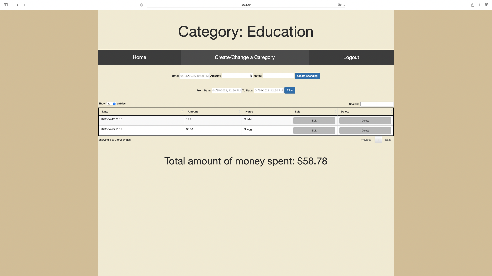

# Spending Tracker 

## Overview

Many people want to keep track of their daily spendings. However, doing that with pen & paper or regular notes is way too difficult and inconvenient. Therefore, that's where Spending Tracker comes in!

Spending Tracker is a web app that will allow users to keep track of their daliy spendings. Users can register and login. Once they're logged in, they can create or view their (past) spendings, categorized by some default and customized types. For each category of the spendings that they have, they can add, edit, or delete items.


## Data Model

The application will store Users, Categories and Spendings.

* Users: user obj, storing the username, password hash, and the types of spending the user have
    * Users can have multiple categories (via references)
* Categories: category obj, storing the user reference, name of the category, and the 
    * each category can have multiple spendings (by embedding)
* Spendings: spendign obj, storing each single spending including date, money amount, and notes

An Example User:

```javascript
{
    username: "shannonshopper",
    hash: , // a password hash
    categories: ["Food", "Entertainment", ...] // an array of references to Category documents
}
```

An Example Category with Embedded Spendings:

```javascript
{
    user: // a reference to a User object
    name: "Food",
    spendings: [
        { date: "2022-03-22 15:24:38", amount: 34.2, notes: "my lunch"},
        { date: "2022-03-23 15:24:38", amount: 50.0, notes: "mt dinner"}
    ]
}
```


## [Link to Commented First Draft Schema](db.js) 

## Wireframes

/category/create - page for creating a new spending category


/category - page for showing all shopping catrgories



/category/slug - page for showing specific shopping list


## Site map

(__TODO__: draw out a site map that shows how pages are related to each other_)

Here's a [complex example from wikipedia](https://upload.wikimedia.org/wikipedia/commons/2/20/Sitemap_google.jpg), but you can create one without the screenshots, drop shadows, etc. ... just names of pages and where they flow to.

## User Stories or Use Cases

1. as non-registered user, I can register a new account with the site
2. as a user, I can log in to the site
3. as a user, I can create a new spending category
4. as a user, I can view all of the spending categories by default or created by myself
5. as a user, I can view all my spendings in either a specific category or in all categories as a whole, with the ability to: select date range, rank them by date or amount
6. as a user, I can add, edit, or delete spendings to an existing category

## Research Topics

* (5 points) Integrate user authentication
    * User authentication is the process of determining whehter or not users are who they claim to be
    * By using user authentication, the communication between client and server will be more secure, thus clients' privacy being protected
    * I'm going to be using passport for user authentication
* (4 points) Perform client side form validation using a JavaScript library
    * see <code>cs.nyu.edu/~jversoza/ait-final/my-form</code>
    * if you put in a number that's greater than 5, an error message will appear in the dom

9 points total out of 8 required points


## [Link to Initial Main Project File](app.js) 


## Annotations / References Used

(__TODO__: list any tutorials/references/etc. that you've based your code off of_)

1. [passport.js authentication docs](http://passportjs.org/docs) - (add link to source code that was based on this)


